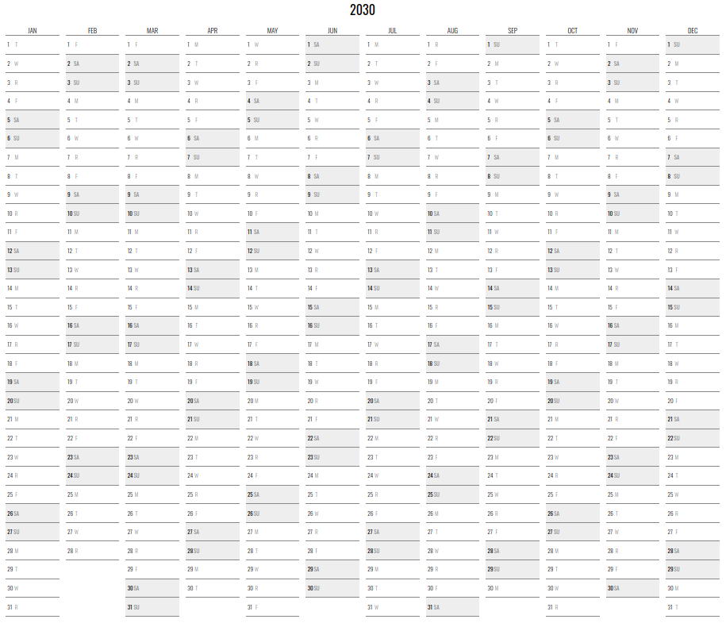

NeatoCal
===

A neato calendar with the full year on a single page.

Based on the very awesome [Neatnik's Calendar](https://neatnik.net/dispenser/?project=calendar) project.

This is a JavaScript port with added parameters (see below) and designed to be "dependency free" with all files local.

Here's a [live demo](https://abetusk.github.io/neatocal).

Screenshots
---




Parameters
---

| URL Parameter | Description | Example |
|---|---|---|
| `year` | Change year (defaul to current year) | [...?year=2030](https://abetusk.github.io/neatocal?year=2030) |
| `start_month` | Start at month other than January. 0 indexed (`0`=Jan, `1`=Feb, ...).  | [...?start_month=7](https://abetusk.github.io/neatocal?start_month=7) |
| `n_month` | Change number of months to something other than 12 (default `12`).  | [...?n_month=6](https://abetusk.github.io/neatocal?n_month=6) |
| `layout` | Changes the layout of the calendar. `default` or `aligned-weekdays`.  | [...?layout=aligned-weekdays](https://abetusk.github.io/neatocal?layout=aligned-weekdays) |
| `start_day` | Start at day other than Monday. 0 indexed (`0`=Sun, `1`=Mon, ...). Only valid with `aligned-weekdays` layout  | [...?layout=aligned-weekdays&start_day=0](https://abetusk.github.io/neatocal?layout=aligned-weekdays&start_day=0) |
| `highlight_color` | Change the weekend highlight color (default `eee`) | [...?highlight_color=fee](https://abetusk.github.io/neatocal?highlight_color=fee) |
| `weekday_code` | Comma separated list of weekday codes to use (default `Su,M,T,W,R,F,Sa`). Elements can be blank if no weekday code is wanted. | [...?weekday_code=S,M,T,W,T,F,S](https://abetusk.github.io/neatocal?weekday_code=S,M,T,W,T,F,S) |
| `month_code` | Comma separated list of month codes to use (default `Jan,Feb,Mar,Apr,May,Jun,Jul,Aug,Sep,Oct,Nov,Dec`). Elements can be blank if no month code is wanted. | [...?month_code=J,F,M,A,M,J,J,A,S,O,N,D](https://abetusk.github.io/neatocal?month_code=J,F,M,A,M,J,J,A,S,O,N,D) |
| `cell_height` | CSS parameter to alter cell height. | [...?cell_height=1.5em](https://abetusk.github.io/neatocal?cell_height=1.5em) |
| `data` | Location of JSON data file. | [...?data=example/data.json](https://abetusk.github.io/neatocal?data=example/data.json) |
| `help` | Show help screen  | [...?help](https://abetusk.github.io/neatocal?help) |

Presets
---

The above parameter list is versatile enough to many options for display. Below is an abreviated list of presets that might be useful to people.

| Preset | Description |
|---|---|
| [Color and aligned](https://abetusk.github.io/neatocal?layout=aligned-weekdays&highlight_color=fee) | Calendar with aligned days and red highlighted weekends |
| [Academic calendar](https://abetusk.github.io/neatocal?start_month=7) | An "academic calendar" that starts on Sept and runs through to August of the following year |
| Half Page [left](https://abetusk.github.io/neatocal?n_month=6) and [right](https://abetusk.github.io/neatocal?start_month=6&n_month=6) calendars | Two half page (6 months) calendars |
| [Non-highlighted calendar](https://abetusk.github.io/neatocal?highlight_color=fff) | Calendar without the weekend highlighting |
| [Chinese month and day](https://abetusk.github.io/neatocal/?month_code=1%E6%9C%88,2%E6%9C%88,3%E6%9C%88,4%E6%9C%88,5%E6%9C%88,6%E6%9C%88,7%E6%9C%88,8%E6%9C%88,9%E6%9C%88,10%E6%9C%88,11%E6%9C%88,12%E6%9C%88&weekday_code=%E6%97%A5,%E4%B8%80,%E4%BA%8C,%E4%B8%89,%E5%9B%9B,%E4%BA%94,%E5%85%AD) | Calendar with (simplified) Chinese month and day abbreviations (thanks to [myway42](https://github.com/myway42/calendar)) |
| [Two year calendar](https://abetusk.github.io/neatocal?n_month=24&layout=aligned-weekdays&start_day=0) | Two year single page calendar |

Data File
---

There is a data file option that can be used to provide parameters or text in the day cells.

The format is:

```
{
  "param" {
    ...
    "color_cell" : [
      { "date":"YYYY-MM-DD", "color":"#rgb" },
      ...
      { "date":"YYYY-MM-DD", "color":"#rgb" }
    ]
  },
  "YYYY-MM-DD" : "text",
  ...
  "YYYY-MM-DD" : "text"
}
```

The file [example/data.json](example/data.json) provides an example:

```
{
  "param": {
    "year":2030,
    "layout":"aligned-weekdays",
    "cell_height": "2em"
  },
  "2030-03-21" : "The quick brown fox jumps over the lazy yellow dog",
  "2030-01-30" : "Sphynx of black quartz, judge my vow",
  "2030-06-01" : "Thule Worm-God of the Lords",
  "2030-08-11" : "Swarms Matriarch",
  "2030-10-20" : "Higher Dimension Being"
}
```


The admissible parameters in the `"param" : {}` section have the same name as the URL parameters.
If a parameter is specified in the data file, they will override any parameters provided in the URL.

`color_cell` allows for individual cell highlighting ([example](https://abetusk.github.io/neatocal?data=example/sched.json)).
See [example/sched.json](example/sched.json) for the example data file with the `color_cell` array.

If the file is not present or isn't able to be parsed, the render will continue as the data file isn't present.


Misc
---

Neatnik's original repo has [since moved](https://neatnik.net/dispenser/?project=calendar) but the legacy GitHub repo can be found [here](https://neatnik.net/dispenser/?project=calendar).

License
---

MIT
