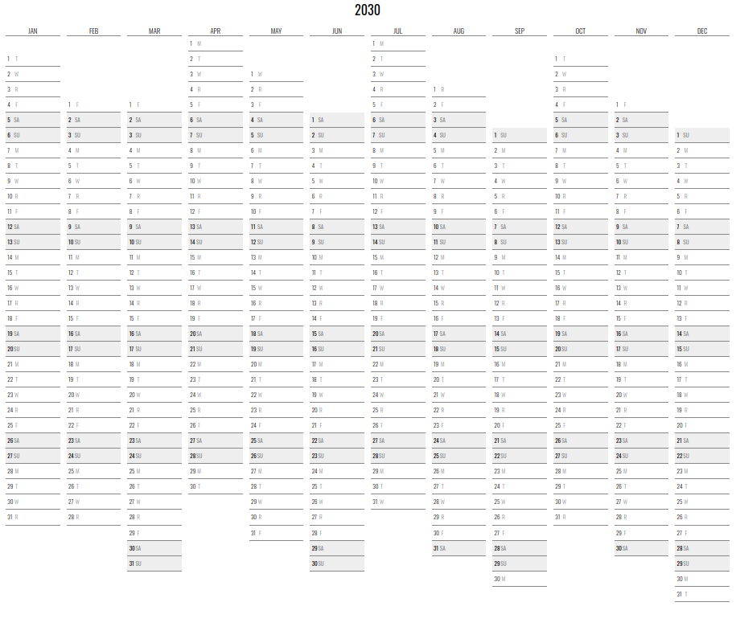

Neatcal
===

A calendar with the full year on a single page.

Based on the very awesome [Neatnik's Calendar](https://github.com/neatnik/calendar) project.

This is a JavaScript port with added parameters (see below) and designed to be "dependency free" with all files local.

Here's a [live demo](https://abetusk.github.io/neatcal).

Screenshots
---

Parameters
---

| URL Parameter | Description | Example |
|---|---|---|
| `year` | Change year (defaul to current year) | [...?year=1923](https://abetusk.github.io/neatcal?year=1923) |
| `start_month` | Start at month other than January. 0 indexed (`0`=Jan, `1`=Feb, ...).  | [...?start_month=7](https://abetusk.github.io/neatcal?start_month=7) |
| `layout` | Changes the layout of the calendar. `default` or `aligned-weekdays``.  | [...?layout=aligned-weekdays](https://abetusk.github.io/neatcal?layout=aligned-weekdays) |
| `start_day` | Start at day other than Monday. 0 indexed (`0`=Sun, `1`=Mon, ...). Only valid with `aligned-weekdays` layout  | [...?layout=aligned-weekdays&start_day=0](https://abetusk.github.io/neatcal?layout=aligned-weekdays&start_day=0) |
| `highlight_color` | Change the weekend highlight color (default `eee`) | [...?highlight_color=fee](https://abetusk.github.io/neatcal?highlight_color=fee) |

License
---

MIT
