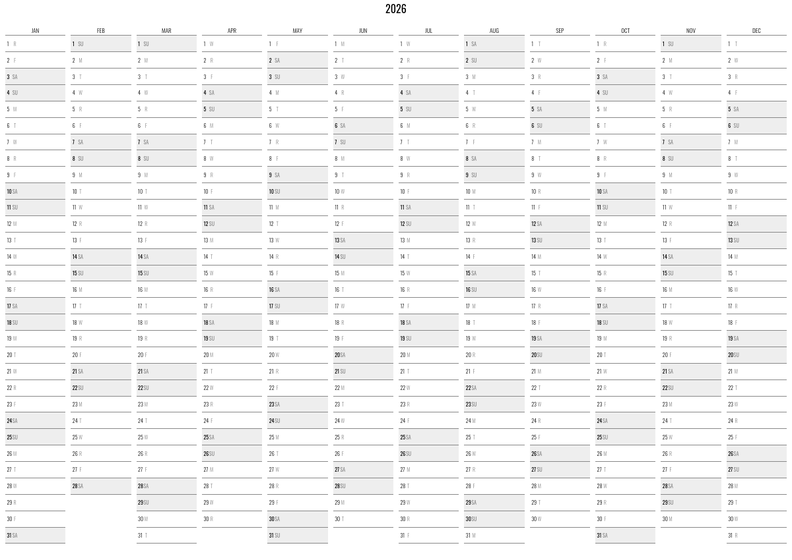
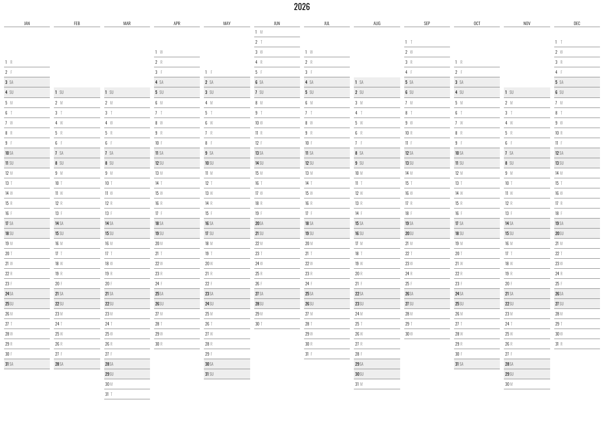
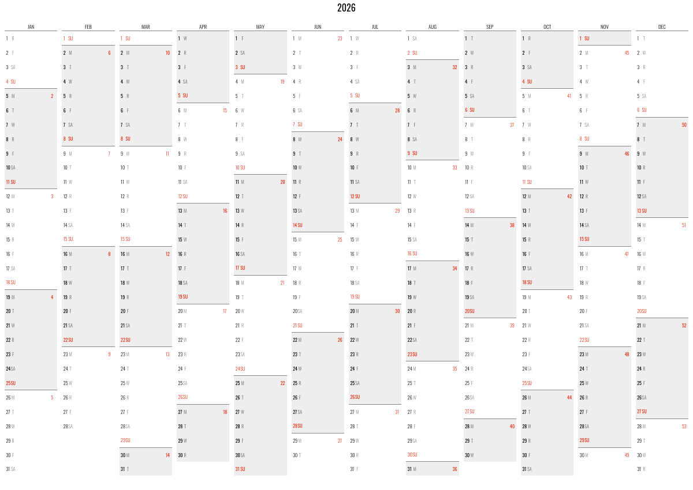
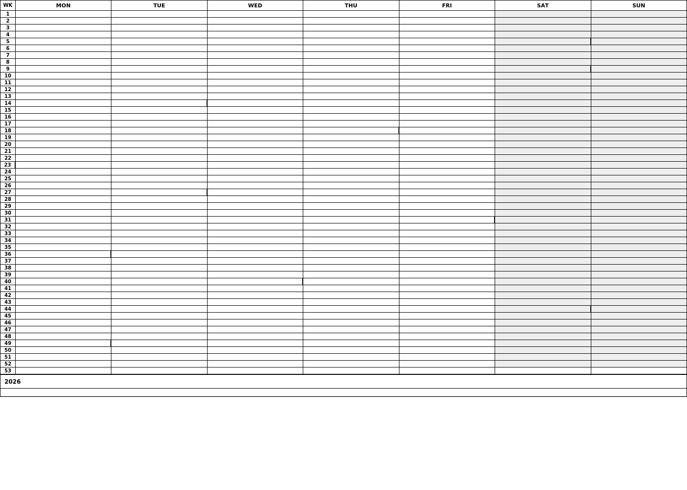
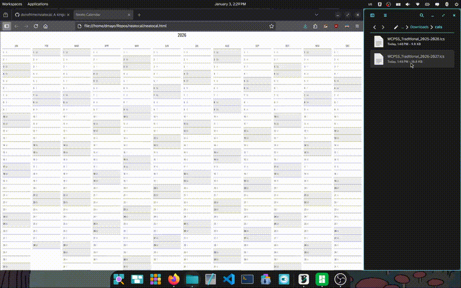

NeatoCal
===

A neato calendar with the full year on a single page.

Here's a [live demo](https://fredrocks.github.io/neatocal).

This is a JavaScript port of the very awesome [Neatnik's Calendar](https://www.neatnik.net/calendar/) project, with added parameters (see below) and designed to be "dependency free" with all files local. Based on [abetusk/neatocal](https://github.com/abetusk/neatocal).

Printing problems? See [printing issues](Printing-Issues.md).


Screenshots
---

[](https://fredrocks.github.io/neatocal)

[](https://fredrocks.github.io/neatocal?layout=aligned-weekdays)

[](https://fredrocks.github.io/neatocal?layout=hallon-almanackan)

[](https://fredrocks.github.io/neatocal?layout=compact-calendar&show_week_numbers=true&year=2026)

Parameters
---

| URL Parameter | Description | Example |
|---|---|---|
| `year` | Change year (default to current year) | [...?year=2030](https://fredrocks.github.io/neatocal?year=2030) |
| `start_month` | Start at month other than January. 0 indexed (`0`=Jan, `1`=Feb, ...).  | [...?start_month=7](https://fredrocks.github.io/neatocal?start_month=7) |
| `n_month` | Change number of months to something other than 12 (default `12`).  | [...?n_month=6](https://fredrocks.github.io/neatocal?n_month=6) |
| `layout` | Changes the layout of the calendar. `default`, `aligned-weekdays`, `hallon-almanackan` or `compact-calendar`.  | [...?layout=aligned-weekdays](https://fredrocks.github.io/neatocal?layout=aligned-weekdays)  [...?layout=hallon-almanackan](https://fredrocks.github.io/neatocal?layout=hallon-almanackan)  [...?layout=compact-calendar](https://fredrocks.github.io/neatocal?layout=compact-calendar) |
| `start_day` | Start at day other than Monday. 0 indexed (`0`=Sun, `1`=Mon, ...). Only valid with `aligned-weekdays` layout  | [...?layout=aligned-weekdays&start_day=0](https://fredrocks.github.io/neatocal?layout=aligned-weekdays&start_day=0) |
| `highlight_color` | Change the weekend highlight color (default `eee`) | [...?highlight_color=fee](https://fredrocks.github.io/neatocal?highlight_color=fee) |
| `today_highlight_color` | Change the current day's highlight color | [...?today_highlight_color=f66](https://fredrocks.github.io/neatocal?today_highlight_color=f66) |
| `language` | Change the language for month and day codes. Values will be overridden if `month_code` or `weekday_code` is specified. | [...?language=ko-KR](https://fredrocks.github.io/neatocal?language=ko-KR) |
| `weekday_code` | Comma separated list of weekday codes to use (default `Su,M,T,W,R,F,Sa`). Elements can be blank if no weekday code is wanted. | [...?weekday_code=S,M,T,W,T,F,S](https://fredrocks.github.io/neatocal?weekday_code=S,M,T,W,T,F,S) |
| `weekday_format` | Change the representation of weekdays (`language` must be specified). `long`, `short` or `narrow` | [...?language=en&weekday_format=narrow](https://fredrocks.github.io/neatocal?language=en&weekday_format=narrow) |
| `month_code` | Comma separated list of month codes to use (default `Jan,Feb,Mar,Apr,May,Jun,Jul,Aug,Sep,Oct,Nov,Dec`). Elements can be blank if no month code is wanted. | [...?month_code=J,F,M,A,M,J,J,A,S,O,N,D](https://fredrocks.github.io/neatocal?month_code=J,F,M,A,M,J,J,A,S,O,N,D) |
| `month_format` | Change the representation of months (`language` must be specified). `numeric`, `2-digit`, `long`, `short` or `narrow` | [...?language=en&month_format=narrow](https://fredrocks.github.io/neatocal?language=en&month_format=narrow) |
| `weekend_days` | Comma separated list of days weekend falls on (0=Sun, 1=Mon, ..., 6=Sat). Default to `0,6`. | [...?weekend_days=5,6](https://fredrocks.github.io/neatocal?weekend_days=5,6) |
| `cell_height` | CSS parameter to alter cell height. | [...?cell_height=1.5em](https://fredrocks.github.io/neatocal?cell_height=1.5em) |
| `show_moon_phase` | Display moon phases on calendar (default `false`). | [...?show_moon_phase=true](https://fredrocks.github.io/neatocal?show_moon_phase=true) |
| `moon_phase_style` | Moon phase display style: `css` (default), `symbol`, or `name`. | [...?show_moon_phase=true&moon_phase_style=symbol](https://fredrocks.github.io/neatocal?show_moon_phase=true&moon_phase_style=symbol) |
| `moon_phase_position` | Position of moon phase: `below` (default) or `inline`. | [...?show_moon_phase=true&moon_phase_position=inline](https://fredrocks.github.io/neatocal?show_moon_phase=true&moon_phase_position=inline) |
| `moon_phase_display` | When to show moon phases: `changes` (default, only on phase transitions) or `all` (every day). | [...?show_moon_phase=true&moon_phase_display=all](https://fredrocks.github.io/neatocal?show_moon_phase=true&moon_phase_display=all) |
| `show_week_numbers` | Displays the week number. (default `false`) | [...?show_week_numbers=true](https://fredrocks.github.io/neatocal?show_week_numbers=true) |
| `font_family` | Changes the font. (default `Oswald`) | [...?font_family=sans-serif](https://fredrocks.github.io/neatocal?font_family=sans-serif) |
| `data` | Location of JSON data file. | [...?data=example/data.json](https://fredrocks.github.io/neatocal?data=example/data.json) |
| `ics` | Show the ICS drag-and-drop prompt overlay on load. | [...?ics](https://fredrocks.github.io/neatocal?ics) |
| `help` | Show help screen  | [...?help](https://fredrocks.github.io/neatocal?help) |

### Detailed Styling

In addition, parameters for weekday text, weekend text, month text, week number, day in month and weekend day in month can be styled with font size, font weight, foreground and background color.

These are given as URL parameters with the `[VARIABLE]_[CSSTYPE]`.
The following prefix and suffixes are available:

| Variable |
|---|
| `year` |
| `month` |
| `weekday` |
| `weekend` |
| `week` |
| `date` |
| `weekend_date` |

| CSS Type Parameter | CSS Variable |
|---|---|
| `font_size` | `fontSize` |
| `font_weight` | `fontWeight` |
| `foreground_color` | `color` |
| `background_color` | `background` |

For example, [...?weekend_font_size=1.4vmin](https://fredrocks.github.io/neatocal?weekend_font_size=1.4vmin).

Presets
---

The above parameter list is versatile enough to provide many options for display. Below is an abbreviated list of presets that might be useful to people.

| Preset | Description |
|---|---|
| [Color and aligned](https://fredrocks.github.io/neatocal?layout=aligned-weekdays&highlight_color=fee) | Calendar with aligned days and red highlighted weekends |
| [Academic calendar](https://fredrocks.github.io/neatocal?start_month=7) | An "academic calendar" that starts on Sept and runs through to August of the following year |
| Half Page [left](https://fredrocks.github.io/neatocal?n_month=6) and [right](https://fredrocks.github.io/neatocal?start_month=6&n_month=6) calendars | Two half page (6 months) calendars |
| [Non-highlighted calendar](https://fredrocks.github.io/neatocal?highlight_color=fff) | Calendar without the weekend highlighting |
| [Chinese month and day](https://fredrocks.github.io/neatocal/?month_code=1%E6%9C%88,2%E6%9C%88,3%E6%9C%88,4%E6%9C%88,5%E6%9C%88,6%E6%9C%88,7%E6%9C%88,8%E6%9C%88,9%E6%9C%88,10%E6%9C%88,11%E6%9C%88,12%E6%9C%88&weekday_code=%E6%97%A5,%E4%B8%80,%E4%BA%8C,%E4%B8%89,%E5%9B%9B,%E4%BA%94,%E5%85%AD) | Calendar with (simplified) Chinese month and day abbreviations (thanks to [myway42](https://github.com/myway42/calendar)) |
| [German month and day](https://fredrocks.github.io/neatocal/?weekday_code=S,M,D,M,D,F,S&month_code=Jan,Feb,M%C3%A4r,Apr,Mai,Jun,Jul,Aug,Sep,Okt,Nov,Dez) ([using language code](https://fredrocks.github.io/neatocal/?language=de-DE)) | Calendar with German month and day abbreviations |
| [Turkish month and day](https://fredrocks.github.io/neatocal/?year=2026&month_code=Oca,%C5%9Eub,Mar,N%C4%B0s,May,Haz,Tem,A%C4%9Fu,Eyl,Ek%C4%B0,Kas,Ara&weekday_code=Pz,Pt,S,%C3%87,Pe,Cu,Ct) | Calendar with Turkish month and day abbreviations |
| [Two year calendar](https://fredrocks.github.io/neatocal?n_month=24&layout=aligned-weekdays&start_day=0) | Two year single page calendar |
| [Moon phase calendar](https://fredrocks.github.io/neatocal?show_moon_phase=true&layout=aligned-weekdays&cell_height=2.5em) | Calendar with SVG moon phases (shows only phase changes) |
| [Moon phase symbols](https://fredrocks.github.io/neatocal?show_moon_phase=true&moon_phase_style=symbol&layout=aligned-weekdays) | Calendar with Unicode moon phase symbols |
| [Moon phase every day](https://fredrocks.github.io/neatocal?show_moon_phase=true&moon_phase_display=all&layout=aligned-weekdays&cell_height=2.5em) | Calendar showing moon phase on every day |

Data File
---

There is a data file option that can be used to provide parameters or text in the day cells.
The `data` value can be an absolute URL like `?data=https://example.com/data.json`.
The only caveats are browser rules: the remote host must allow CORS (e.g. `Access-Control-Allow-Origin`),
and mixed-content rules apply (HTTPS page can’t load HTTP JSON).

The format is:

```
{
  "param": {
    ...
    "color_cell" : [
      { "date":"YYYY-MM-DD", "color":"#rgb" },
      ...
      { "date":"YYYY-MM-DD", "color":"#rgb" }
    ]
  },
  "YYYY-MM-DD" : "text",
  ...
  "YYYY-MM-DD" : "text"
}
```

The file [example/data.json](example/data.json) provides an example:

```
{
  "param": {
    "year":2030,
    "layout":"aligned-weekdays",
    "cell_height": "2em"
  },
  "2030-03-21" : "The quick brown fox jumps over the lazy yellow dog",
  "2030-01-30" : "Sphynx of black quartz, judge my vow",
  "2030-06-01" : "Thule Worm-God of the Lords",
  "2030-08-11" : "Swarms Matriarch",
  "2030-10-20" : "Higher Dimension Being"
}
```

The file [example/ie-co-2026.json](example/ie-co-2026.json) provides a combined Colombia and Ireland
holiday schedule for 2026 ([compact calendar example](https://abetusk.github.io/neatocal?layout=compact-calendar&data=example/ie-co-2026.json)).


The admissible parameters in the `"param" : {}` section have the same name as the URL parameters.
If a parameter is specified in the data file, they will override any parameters provided in the URL.

`color_cell` allows for individual cell highlighting ([example](https://fredrocks.github.io/neatocal?data=example/sched.json)).
See [example/sched.json](example/sched.json) for the example data file with the `color_cell` array.

Moon phase parameters (`show_moon_phase`, `moon_phase_style`, `moon_phase_position`, `moon_phase_display`) can also be set in the `param` section
([moon phase example](https://fredrocks.github.io/neatocal?data=example/moon_phase.json)).

If the file is not present or isn't able to be parsed, the render will continue as the data file isn't present.

ICS Import (Drag-and-drop)
---

You can drop one or more `.ics` calendar files onto the page to import events on the fly.
Imported events are displayed in each day cell, and multi-day events render as a new entry each day



Using the `ics` URL parameter will make the drag-and-drop interface appear on initial load and disappear after
an ICS file is loaded.

An example ICS file is located in `example/example.ics`.

Notes:
- Recurrence rules (`RRULE`) are currently ignored.
- All-day and timed events are supported; all-day events use the end date as exclusive.


Misc
---

Neatnik's original repo can be found at [source.tube/neatnik/calendar](https://source.tube/neatnik/calendar).

Compact Calendar
---

The compact calendar layout displays the full year as a weekly grid with 52-53 rows (one per ISO week) and 7 day columns (Mon-Sun). This is useful for year-at-a-glance planning.

| URL Parameter | Description | Example |
|---|---|---|
| `compact_notes` | Show a notes sidebar (default `true`) | [...?layout=compact-calendar&compact_notes=false](https://fredrocks.github.io/neatocal?layout=compact-calendar&compact_notes=false) |
| `compact_notes_width` | Width of notes sidebar (default `28%`) | [...?layout=compact-calendar&compact_notes_width=35%](https://fredrocks.github.io/neatocal?layout=compact-calendar&compact_notes_width=35%25) |
| `compact_cell_height` | Height of each day cell (default `10.5px`) | [...?layout=compact-calendar&compact_cell_height=14px](https://fredrocks.github.io/neatocal?layout=compact-calendar&compact_cell_height=14px) |

Example with holiday data: [...?layout=compact-calendar&data=example/ie-co-2026.json&year=2026](https://fredrocks.github.io/neatocal?layout=compact-calendar&data=example/ie-co-2026.json&year=2026)

Compact Calendar
---
https://github.com/fredrocks/neatocal?layout=compact-calendar&data=example/ie-co-2026.json
https://github.io/fredrocks/neatocal?layout=compact-calendar&data=example/ie-co-2026.json

License
---

[MIT](LICENSE)
